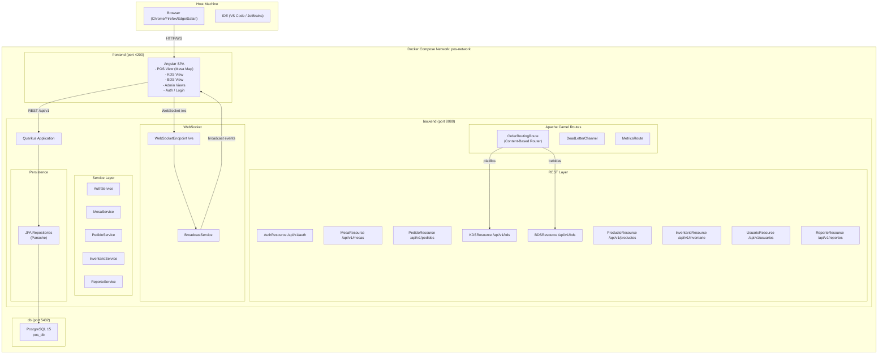
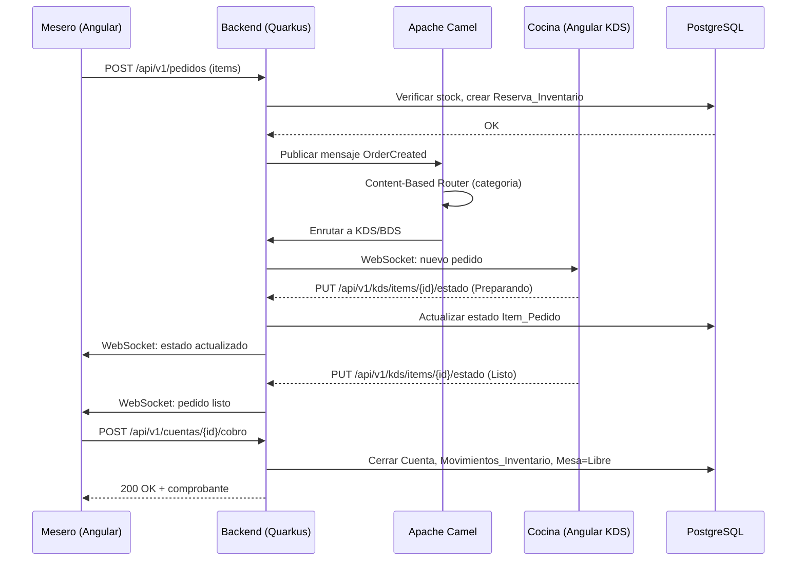
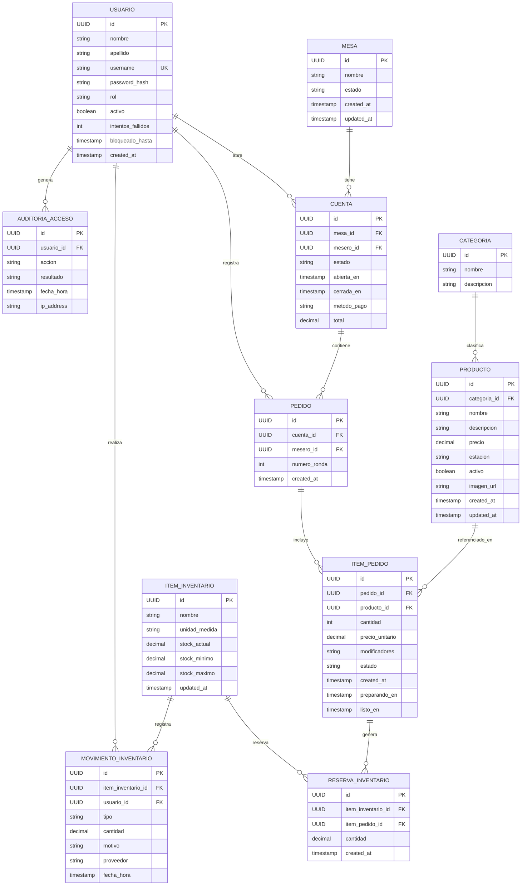
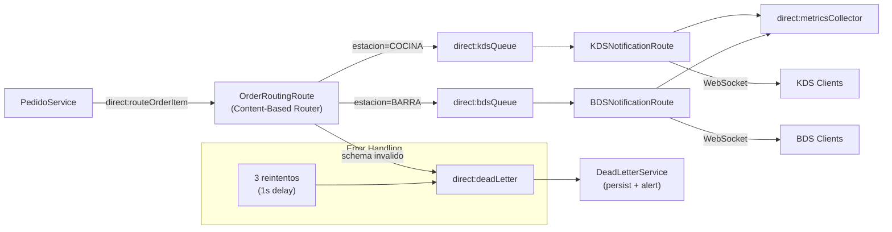

# Design Document: POS Restaurant System

> **Feature:** devcontainer-setup
> **Workflow:** Requirements-First
> **Stack:** Java 17 + Quarkus + Apache Camel | Angular | PostgreSQL | Docker Compose

---

## Overview

El sistema POS (Punto de Venta) para restaurante es una aplicacion web multi-modulo que gestiona el ciclo completo de operacion de un restaurante: desde la autenticacion de usuarios y gestion de mesas, hasta el registro de pedidos, preparacion en cocina/barra, cobro y reportes financieros.

La arquitectura sigue un patron de **monolito modular** desplegado como contenedor Docker, con separacion clara entre capas (API REST, logica de negocio, persistencia) y comunicacion en tiempo real via WebSocket. Apache Camel gestiona el enrutamiento interno de mensajes entre modulos, implementando patrones de integracion empresarial (EIP) como Dead Letter Channel y Content-Based Router.

### Principios de Diseno

- **Separacion de responsabilidades**: Cada modulo funcional (Auth, Mesas, Pedidos, KDS, BDS, Inventario, Reportes) tiene su propia capa de recursos REST, servicio de negocio y repositorio.
- **Tiempo real**: WebSocket para sincronizacion entre POS, KDS y BDS sin polling.
- **Trazabilidad**: Cada solicitud HTTP lleva un traceId propagado en logs y respuestas de error.
- **Seguridad por defecto**: RBAC en cada endpoint, contrasenas con bcrypt, CORS configurado.
- **Entorno reproducible**: DevContainer con Docker Compose garantiza paridad entre entornos de desarrollo.
- **Auditoria completa**: Movimientos de inventario, accesos de usuarios y cambios de estado registrados con timestamp y usuario responsable.
## Architecture

### Diagrama de Componentes



### Flujo de Datos Principal


## Components and Interfaces

### Backend: Estructura de Paquetes Quarkus

```
pos-backend/
src/main/java/com/restaurant/pos/
  auth/
    AuthResource.java          # POST /api/v1/auth/login, POST /api/v1/auth/logout
    AuthService.java
    JwtUtil.java
    PasswordHasher.java        # bcrypt wrapper
    RoleGuard.java             # @RolesAllowed interceptor
  mesa/
    MesaResource.java          # GET/POST/PUT/DELETE /api/v1/mesas
    MesaService.java
    Mesa.java                  # @Entity
    MesaRepository.java        # PanacheRepository
    MesaEstado.java            # enum: LIBRE, OCUPADA, RESERVADA
  cuenta/
    CuentaResource.java        # GET/POST /api/v1/cuentas, POST /api/v1/cuentas/{id}/cobro
    CuentaService.java
    Cuenta.java                # @Entity
    CuentaRepository.java
    CuentaEstado.java          # enum: ABIERTA, CERRADA
  pedido/
    PedidoResource.java        # GET/POST /api/v1/pedidos, DELETE /api/v1/pedidos/{id}/items/{itemId}
    PedidoService.java
    Pedido.java                # @Entity
    ItemPedido.java            # @Entity
    ItemPedidoEstado.java      # enum: PENDIENTE, PREPARANDO, LISTO
    PedidoRepository.java
    ItemPedidoRepository.java
  kds/
    KDSResource.java           # GET /api/v1/kds/items, PUT /api/v1/kds/items/{id}/estado
    KDSService.java
  bds/
    BDSResource.java           # GET /api/v1/bds/items, PUT /api/v1/bds/items/{id}/estado
    BDSService.java
  producto/
    ProductoResource.java      # GET/POST/PUT/DELETE /api/v1/productos
    ProductoService.java
    Producto.java              # @Entity
    ProductoRepository.java
    Categoria.java             # @Entity
    CategoriaRepository.java
    Estacion.java              # enum: COCINA, BARRA
  inventario/
    InventarioResource.java    # GET/POST /api/v1/inventario, POST /api/v1/inventario/{id}/movimientos
    InventarioService.java
    ItemInventario.java        # @Entity
    MovimientoInventario.java  # @Entity
    ReservaInventario.java     # @Entity
    TipoMovimiento.java        # enum: ENTRADA, SALIDA_VENTA, AJUSTE, MERMA
  usuario/
    UsuarioResource.java       # GET/POST/PUT /api/v1/usuarios
    UsuarioService.java
    Usuario.java               # @Entity
    UsuarioRepository.java
    Rol.java                   # enum: ADMIN, MESERO, COCINA, BARRA
    AuditoriaAcceso.java       # @Entity
  reporte/
    ReporteResource.java       # GET /api/v1/reportes/ventas, /productos, /inventario, /operacion
    ReporteService.java
    ReporteVentasDTO.java
    ReporteProductosDTO.java
  camel/
    OrderRoutingRoute.java     # RouteBuilder: Content-Based Router
    DeadLetterRoute.java       # RouteBuilder: DLC
    CamelMetricsRoute.java     # RouteBuilder: metricas
  websocket/
    PosWebSocketEndpoint.java  # @ServerEndpoint("/ws")
    WebSocketBroadcastService.java
    WebSocketEvent.java        # DTO: tipo, payload, timestamp
  common/
    TraceIdFilter.java         # JAX-RS ContainerRequestFilter
    GlobalExceptionMapper.java # ExceptionMapper
    PaginationParams.java      # @BeanParam: page, size
    ApiResponse.java           # wrapper estandar
    ErrorResponse.java         # { field, message, traceId }
src/main/resources/
  application.properties
  application-dev.properties
  application-prod.properties
  db/migration/               # Flyway migrations
    V1__create_schema.sql
    V2__seed_data.sql
```

### Frontend: Estructura Angular

```
pos-frontend/
src/
  app/
    core/
      auth/
        auth.service.ts        # login, logout, token management (sessionStorage)
        auth.guard.ts          # CanActivate para rutas protegidas
        auth.interceptor.ts    # adjunta token, maneja 401
        role.guard.ts          # CanActivate por rol
      websocket/
        websocket.service.ts   # conexion /ws, reconexion exponencial
        websocket.model.ts     # WebSocketEvent interface
      http/
        api.service.ts         # base URL desde environment.apiUrl
      error/
        global-error-handler.ts
    shared/
      components/
        product-placeholder/   # placeholder determinista por nombre
        loading-spinner/
        error-banner/          # banner cuando backend no responde
        confirm-dialog/
      pipes/
        currency-format.pipe.ts
        elapsed-time.pipe.ts
    features/
      login/
        login.component.ts
        login.component.html
      pos/
        pos.component.ts       # mapa de mesas
        mesa-card.component.ts # estado visual: LIBRE/OCUPADA/RESERVADA
        cuenta-detail.component.ts
        pedido-form.component.ts
      kds/
        kds.component.ts       # vista cocina
        kds-item.component.ts  # item con timer, resaltado si >15min
      bds/
        bds.component.ts       # vista barra
        bds-item.component.ts  # item con timer, resaltado si >10min
      cobro/
        cobro.component.ts     # resumen + metodo pago + cambio
      admin/
        productos/
          producto-list.component.ts
          producto-form.component.ts  # con upload de imagen
        inventario/
          inventario-list.component.ts
          movimiento-form.component.ts
        usuarios/
          usuario-list.component.ts
          usuario-form.component.ts
        reportes/
          reporte-ventas.component.ts
          reporte-productos.component.ts
          reporte-inventario.component.ts
          reporte-operacion.component.ts
        mesas/
          mesa-admin.component.ts
  environments/
    environment.ts             # apiUrl, wsUrl para dev
    environment.prod.ts        # apiUrl, wsUrl para prod
```
## Data Models

### Diagrama Entidad-Relacion



### DTOs Principales

#### AuthLoginRequest / AuthLoginResponse
```json
// Request
{ "username": "mesero01", "password": "secret" }

// Response
{
  "token": "Basic base64encoded",
  "usuario": { "id": "uuid", "nombre": "Juan", "rol": "MESERO" },
  "expiresAt": "2024-01-01T12:00:00Z"
}
```

#### MesaDTO
```json
{
  "id": "uuid",
  "nombre": "Mesa 5",
  "estado": "OCUPADA",
  "cuentaId": "uuid",
  "totalAcumulado": 450.00,
  "tiempoAbierta": 1800
}
```

#### ItemPedidoDTO
```json
{
  "id": "uuid",
  "productoId": "uuid",
  "productoNombre": "Tacos de Birria",
  "cantidad": 2,
  "precioUnitario": 85.00,
  "modificadores": "sin cebolla",
  "estado": "PENDIENTE",
  "estacion": "COCINA",
  "mesaNombre": "Mesa 5",
  "tiempoEspera": 720
}
```

#### WebSocketEvent
```json
{
  "tipo": "ITEM_ESTADO_CAMBIADO",
  "payload": {
    "itemPedidoId": "uuid",
    "cuentaId": "uuid",
    "mesaId": "uuid",
    "nuevoEstado": "LISTO",
    "estacion": "COCINA"
  },
  "timestamp": "2024-01-01T12:05:00Z"
}
```

Tipos de eventos WebSocket:
- PEDIDO_CREADO - nuevo pedido enviado a estacion
- ITEM_ESTADO_CAMBIADO - KDS/BDS actualizo estado
- PEDIDO_COMPLETO - todos los items de un pedido estan LISTO
- MESA_ESTADO_CAMBIADO - mesa cambio de estado
- STOCK_ALERTA - stock bajo minimo
- BACKEND_UNAVAILABLE - backend no responde (generado por frontend)
## API REST Design

Todos los endpoints siguen el path base /api/v1. Autenticacion via Basic Auth header en cada request.

### Autenticacion

| Metodo | Path | Rol | Descripcion |
|--------|------|-----|-------------|
| POST | /api/v1/auth/login | Publico | Autenticar usuario, retorna token |
| POST | /api/v1/auth/logout | Autenticado | Invalidar sesion activa |
| PUT | /api/v1/auth/password | Autenticado | Cambiar contrasena propia |

### Mesas

| Metodo | Path | Rol | Descripcion |
|--------|------|-----|-------------|
| GET | /api/v1/mesas | Mesero, Admin | Listar todas las mesas con estado |
| POST | /api/v1/mesas | Admin | Crear nueva mesa |
| PUT | /api/v1/mesas/{id} | Admin | Editar mesa |
| DELETE | /api/v1/mesas/{id} | Admin | Eliminar mesa (si no tiene cuenta abierta) |
| POST | /api/v1/mesas/{id}/abrir | Mesero, Admin | Abrir cuenta en mesa libre |

### Cuentas y Pedidos

| Metodo | Path | Rol | Descripcion |
|--------|------|-----|-------------|
| GET | /api/v1/cuentas/{id} | Mesero, Admin | Detalle de cuenta con items |
| POST | /api/v1/cuentas/{id}/pedidos | Mesero, Admin | Agregar ronda de pedido |
| DELETE | /api/v1/cuentas/{id}/pedidos/{pedidoId}/items/{itemId} | Mesero, Admin | Eliminar item (pre-envio) |
| POST | /api/v1/cuentas/{id}/cobro | Mesero, Admin | Cobrar y cerrar cuenta |

### KDS / BDS

| Metodo | Path | Rol | Descripcion |
|--------|------|-----|-------------|
| GET | /api/v1/kds/items | Cocina, Admin | Items pendientes/preparando en cocina |
| PUT | /api/v1/kds/items/{id}/estado | Cocina, Admin | Actualizar estado item (PREPARANDO/LISTO) |
| GET | /api/v1/bds/items | Barra, Admin | Items pendientes/preparando en barra |
| PUT | /api/v1/bds/items/{id}/estado | Barra, Admin | Actualizar estado item (PREPARANDO/LISTO) |

### Productos y Categorias

| Metodo | Path | Rol | Descripcion |
|--------|------|-----|-------------|
| GET | /api/v1/productos | Mesero, Admin | Listar productos activos (paginado) |
| POST | /api/v1/productos | Admin | Crear producto |
| PUT | /api/v1/productos/{id} | Admin | Editar producto |
| DELETE | /api/v1/productos/{id} | Admin | Desactivar producto |
| POST | /api/v1/productos/{id}/imagen | Admin | Subir imagen (multipart/form-data) |
| DELETE | /api/v1/productos/{id}/imagen | Admin | Eliminar imagen |
| GET | /api/v1/categorias | Mesero, Admin | Listar categorias |
| POST | /api/v1/categorias | Admin | Crear categoria |
| PUT | /api/v1/categorias/{id} | Admin | Editar categoria |
| DELETE | /api/v1/categorias/{id} | Admin | Eliminar categoria (sin productos) |

### Inventario

| Metodo | Path | Rol | Descripcion |
|--------|------|-----|-------------|
| GET | /api/v1/inventario | Admin | Listar items de inventario |
| POST | /api/v1/inventario | Admin | Crear item de inventario |
| PUT | /api/v1/inventario/{id} | Admin | Editar item (stock min/max) |
| POST | /api/v1/inventario/{id}/movimientos | Admin | Registrar entrada/ajuste/merma |
| GET | /api/v1/inventario/{id}/movimientos | Admin | Historial de movimientos (paginado) |

### Usuarios

| Metodo | Path | Rol | Descripcion |
|--------|------|-----|-------------|
| GET | /api/v1/usuarios | Admin | Listar usuarios |
| POST | /api/v1/usuarios | Admin | Crear usuario |
| PUT | /api/v1/usuarios/{id} | Admin | Editar usuario |
| PUT | /api/v1/usuarios/{id}/desactivar | Admin | Desactivar usuario |
| PUT | /api/v1/usuarios/{id}/reset-password | Admin | Resetear contrasena |

### Reportes

| Metodo | Path | Rol | Descripcion |
|--------|------|-----|-------------|
| GET | /api/v1/reportes/ventas | Admin | Reporte ventas por periodo |
| GET | /api/v1/reportes/productos | Admin | Productos mas vendidos |
| GET | /api/v1/reportes/inventario | Admin | Estado inventario y movimientos |
| GET | /api/v1/reportes/operacion | Admin | Operacion por turno |
| GET | /api/v1/reportes/ventas/export | Admin | Exportar CSV ventas |
| GET | /api/v1/reportes/productos/export | Admin | Exportar CSV productos |

Parametros de query comunes:
- page=0&size=20 - paginacion (size max 100)
- desde=2024-01-01&hasta=2024-01-31 - filtro por periodo
- 	urnoId=uuid - filtro por turno

### Codigos de Respuesta

| Codigo | Uso |
|--------|-----|
| 200 | Exito en GET/PUT |
| 201 | Creacion exitosa (POST) |
| 204 | Eliminacion exitosa (DELETE) |
| 400 | Validacion fallida: { "field": "cantidad", "message": "debe ser mayor a 0", "traceId": "..." } |
| 401 | No autenticado |
| 403 | Sin permisos para el rol |
| 404 | Recurso no encontrado |
| 409 | Conflicto de estado (ej: mesa ya ocupada) |
| 500 | Error interno: { "message": "Error interno", "traceId": "..." } |
## Apache Camel Routes Design

### Ruta 1: OrderRoutingRoute (Content-Based Router)

Enruta cada ItemPedido a la estacion correcta basandose en la categoria del producto.

```java
// OrderRoutingRoute.java
@ApplicationScoped
public class OrderRoutingRoute extends RouteBuilder {
    @Override
    public void configure() {
        // Dead Letter Channel: 3 reintentos, luego DLC
        errorHandler(deadLetterChannel("direct:deadLetter")
            .maximumRedeliveries(3)
            .redeliveryDelay(1000)
            .logExhausted(true));

        from("direct:routeOrderItem")
            .routeId("order-routing-route")
            .log("Procesando ItemPedido: ")
            .validate(body().isNotNull())
            .choice()
                .when(header("estacion").isEqualTo("COCINA"))
                    .to("direct:kdsQueue")
                .when(header("estacion").isEqualTo("BARRA"))
                    .to("direct:bdsQueue")
                .otherwise()
                    .to("direct:deadLetter")
            .end()
            .log("ItemPedido enrutado en ms");
    }
}
```

### Ruta 2: KDSNotificationRoute

Recibe items de cocina y notifica via WebSocket.

```java
from("direct:kdsQueue")
    .routeId("kds-notification-route")
    .log("Notificando KDS: mesa=")
    .bean(WebSocketBroadcastService.class, "broadcastToKDS")
    .to("direct:metricsCollector");
```

### Ruta 3: BDSNotificationRoute

Recibe items de barra y notifica via WebSocket.

```java
from("direct:bdsQueue")
    .routeId("bds-notification-route")
    .log("Notificando BDS: mesa=")
    .bean(WebSocketBroadcastService.class, "broadcastToBDS")
    .to("direct:metricsCollector");
```

### Ruta 4: DeadLetterRoute

Captura mensajes fallidos despues de 3 reintentos.

```java
from("direct:deadLetter")
    .routeId("dead-letter-route")
    .log(LoggingLevel.ERROR, "Mensaje fallido: , causa: ")
    .bean(DeadLetterService.class, "persist")
    .to("direct:alertAdmin");
```

### Ruta 5: MetricsRoute

Agrega metricas de procesamiento para Prometheus.

```java
from("direct:metricsCollector")
    .routeId("metrics-route")
    .process(exchange -> {
        // Registrar en MicroProfile Metrics
        Counter.builder("camel.messages.processed")
            .tag("route", exchange.getFromRouteId())
            .register(registry)
            .increment();
    });
```

### Diagrama de Flujo Camel



### Metricas Expuestas por Camel

- camel.messages.processed{route="order-routing-route"} - mensajes procesados
- camel.messages.failed{route="order-routing-route"} - mensajes fallidos
- camel.processing.time.p50/p95/p99{route="..."} - tiempos de procesamiento
- camel.dead.letter.count - mensajes en DLC
## WebSocket Design

### Endpoint

```
ws://backend:8080/ws
```

El cliente Angular se conecta al iniciar sesion y mantiene la conexion activa durante toda la sesion.

### Protocolo de Mensajes

Todos los mensajes son JSON con la estructura WebSocketEvent:

```json
{
  "tipo": "PEDIDO_CREADO",
  "payload": { "..." : "..." },
  "timestamp": "ISO-8601"
}
```

### Suscripciones por Rol

| Rol | Eventos recibidos |
|-----|-------------------|
| Mesero | ITEM_ESTADO_CAMBIADO, PEDIDO_COMPLETO, MESA_ESTADO_CAMBIADO |
| Cocina | PEDIDO_CREADO (estacion=COCINA) |
| Barra | PEDIDO_CREADO (estacion=BARRA) |
| Admin | Todos los eventos |

### Implementacion Backend (Quarkus)

```java
@ServerEndpoint("/ws")
@ApplicationScoped
public class PosWebSocketEndpoint {

    @Inject
    WebSocketBroadcastService broadcastService;

    @OnOpen
    public void onOpen(Session session) {
        broadcastService.register(session);
        log.info("Cliente conectado: sessionId={}", session.getId());
    }

    @OnClose
    public void onClose(Session session) {
        broadcastService.unregister(session);
        log.info("Cliente desconectado: sessionId={}", session.getId());
    }

    @OnError
    public void onError(Session session, Throwable throwable) {
        log.error("Error WebSocket: sessionId={}, error={}", session.getId(), throwable.getMessage());
        broadcastService.unregister(session);
    }
}
```

### Reconexion con Retroceso Exponencial

```
Intento 1: esperar 1s
Intento 2: esperar 2s
Intento 3: esperar 4s
Intento 4: esperar 8s
Intento 5: esperar 16s (maximo 30s)
Despues de 5 intentos: mostrar error de conectividad al usuario
```

### Sincronizacion al Reconectar

Cuando un cliente se reconecta, el backend envia el estado actual:

```json
{
  "tipo": "SYNC_STATE",
  "payload": {
    "mesas": ["..."],
    "pedidosActivos": ["..."],
    "itemsKDS": ["..."],
    "itemsBDS": ["..."]
  },
  "timestamp": "..."
}
```
## DevContainer and Docker Compose Configuration

### Estructura de Archivos

```
.devcontainer/
  devcontainer.json
  docker-compose.yml
  .env.example
README.md
```

### devcontainer.json

```json
{
  "name": "POS Restaurant System",
  "dockerComposeFile": "docker-compose.yml",
  "service": "backend",
  "workspaceFolder": "/workspace",
  "forwardPorts": [8080, 5005, 4200, 5432],
  "portsAttributes": {
    "8080": { "label": "Quarkus HTTP", "onAutoForward": "notify" },
    "5005": { "label": "Java Debug (JDWP)", "onAutoForward": "silent" },
    "4200": { "label": "Angular Dev Server", "onAutoForward": "openBrowser" },
    "5432": { "label": "PostgreSQL", "onAutoForward": "silent" }
  },
  "postCreateCommand": "cd /workspace/pos-backend && mvn dependency:resolve -q && cd /workspace/pos-frontend && npm install --silent",
  "postStartCommand": "cd /workspace/pos-backend && mvn quarkus:dev -Ddebug=5005 &",
  "customizations": {
    "vscode": {
      "extensions": [
        "redhat.java",
        "vscjava.vscode-java-debug",
        "vscjava.vscode-maven",
        "redhat.vscode-quarkus",
        "redhat.vscode-apache-camel",
        "Angular.ng-template",
        "dbaeumer.vscode-eslint",
        "ms-azuretools.vscode-docker",
        "eamodio.gitlens",
        "humao.rest-client",
        "ms-vscode.vscode-json"
      ],
      "settings": {
        "java.configuration.runtimes": [
          { "name": "JavaSE-17", "path": "/usr/lib/jvm/java-17-openjdk-amd64" }
        ],
        "editor.formatOnSave": true
      }
    }
  },
  "features": {
    "ghcr.io/devcontainers/features/java:1": {
      "version": "17",
      "installMaven": true,
      "mavenVersion": "3.9"
    },
    "ghcr.io/devcontainers/features/node:1": {
      "version": "20"
    }
  }
}
```

### docker-compose.yml

```yaml
version: '3.9'

networks:
  pos-network:
    driver: bridge

volumes:
  postgres-data:
  maven-cache:
  node-modules:

services:
  db:
    image: postgres:15-alpine
    container_name: pos-db
    environment:
      POSTGRES_DB: pos_db
      POSTGRES_USER: pos_user
      POSTGRES_PASSWORD: pos_password
    ports:
      - "5432:5432"
    volumes:
      - postgres-data:/var/lib/postgresql/data
    networks:
      - pos-network
    healthcheck:
      test: ["CMD-SHELL", "pg_isready -U pos_user -d pos_db"]
      interval: 10s
      timeout: 3s
      retries: 5
      start_period: 10s

  backend:
    build:
      context: ./pos-backend
      dockerfile: Dockerfile.dev
    container_name: pos-backend
    environment:
      QUARKUS_DATASOURCE_JDBC_URL: jdbc:postgresql://db:5432/pos_db
      QUARKUS_DATASOURCE_USERNAME: pos_user
      QUARKUS_DATASOURCE_PASSWORD: pos_password
      QUARKUS_LOG_LEVEL: DEBUG
      JAVA_TOOL_OPTIONS: "-agentlib:jdwp=transport=dt_socket,server=y,suspend=n,address=*:5005"
    ports:
      - "8080:8080"
      - "5005:5005"
    volumes:
      - ./pos-backend:/workspace/pos-backend
      - maven-cache:/root/.m2/repository
    networks:
      - pos-network
    depends_on:
      db:
        condition: service_healthy
    healthcheck:
      test: ["CMD", "curl", "-f", "http://localhost:8080/q/health/live"]
      interval: 30s
      timeout: 5s
      retries: 3
      start_period: 60s

  frontend:
    build:
      context: ./pos-frontend
      dockerfile: Dockerfile.dev
    container_name: pos-frontend
    environment:
      NODE_ENV: development
      API_URL: http://backend:8080
    ports:
      - "4200:4200"
    volumes:
      - ./pos-frontend:/workspace/pos-frontend
      - node-modules:/workspace/pos-frontend/node_modules
    networks:
      - pos-network
    depends_on:
      - backend
```

### .env.example

`ash
# Base de datos
POSTGRES_DB=pos_db
POSTGRES_USER=pos_user
POSTGRES_PASSWORD=pos_password

# Backend
QUARKUS_DATASOURCE_JDBC_URL=jdbc:postgresql://db:5432/pos_db
QUARKUS_DATASOURCE_USERNAME=pos_user
QUARKUS_DATASOURCE_PASSWORD=pos_password
QUARKUS_LOG_LEVEL=DEBUG

# Frontend
NODE_ENV=development
API_URL=http://backend:8080
WS_URL=ws://backend:8080/ws

# JWT (si se implementa JWT en lugar de Basic Auth)
JWT_SECRET=change-me-in-production
JWT_EXPIRATION_HOURS=8
```

### application.properties (Quarkus)

```properties
# Datasource
quarkus.datasource.db-kind=postgresql
quarkus.datasource.jdbc.url=
quarkus.datasource.username=
quarkus.datasource.password=

# Hibernate ORM / Flyway
quarkus.hibernate-orm.database.generation=none
quarkus.flyway.migrate-at-start=true
quarkus.flyway.locations=classpath:db/migration

# HTTP
quarkus.http.port=8080
quarkus.http.cors=true
quarkus.http.cors.origins=

# OpenAPI
quarkus.smallrye-openapi.path=/q/openapi
quarkus.swagger-ui.always-include=true

# Logging (JSON estructurado)
quarkus.log.console.json=true
quarkus.log.level=

# Health
quarkus.smallrye-health.root-path=/q/health

# Metrics (Prometheus)
quarkus.micrometer.export.prometheus.enabled=true
quarkus.micrometer.export.prometheus.path=/q/metrics

# Compresion GZIP
quarkus.http.enable-compression=true
quarkus.http.compress-media-types=application/json,text/plain
```
## Correctness Properties

*A property is a characteristic or behavior that should hold true across all valid executions of a system - essentially, a formal statement about what the system should do. Properties serve as the bridge between human-readable specifications and machine-verifiable correctness guarantees.*

Property-based testing (PBT) is applicable to this feature because the system contains significant pure business logic: RBAC enforcement, state machine transitions (Mesa, Cuenta, ItemPedido), inventory arithmetic, routing logic, and data calculations (totals, change). These are all functions with clear input/output behavior where input variation reveals edge cases.

**PBT Library**: [QuickTheories](https://github.com/quicktheories/QuickTheories) for Java backend tests.

---

### Property 1: Autenticacion rechaza credenciales invalidas

*For any* set of credentials where the username does not exist or the password does not match the stored hash, the authentication system SHALL reject the request and return HTTP 401.

**Validates: Requirements 10.1, 10.2**

---

### Property 2: Hash de contrasena es irreversible

*For any* plaintext password, the stored bcrypt hash SHALL never equal the plaintext, and bcrypt.verify(plaintext, hash) SHALL return true.

**Validates: Requirements 10.2**

---

### Property 3: RBAC - acciones fuera de rol son rechazadas

*For any* authenticated user with role R and any endpoint E that requires a different role, the system SHALL return HTTP 403 and SHALL NOT execute the operation.

**Validates: Requirements 10.4, 10.5, 10.6, 10.7, 10.8**

---

### Property 4: Sesion invalida despues de logout

*For any* valid session token T, after the user logs out using T, any subsequent request using T SHALL return HTTP 401.

**Validates: Requirements 10.9**

---

### Property 5: Estado de Mesa es siempre valido

*For any* mesa in the system at any point in time, its estado SHALL be exactly one of {LIBRE, OCUPADA, RESERVADA}.

**Validates: Requirements 11.1, 11.2**

---

### Property 6: Abrir mesa libre crea cuenta y cambia estado

*For any* mesa with estado=LIBRE, after a mesero opens it, the mesa estado SHALL be OCUPADA and exactly one Cuenta with estado=ABIERTA SHALL exist for that mesa.

**Validates: Requirements 11.3**

---

### Property 7: Cerrar cuenta libera mesa

*For any* mesa with estado=OCUPADA and an associated open Cuenta, after the Cuenta is closed via cobro, the mesa estado SHALL be LIBRE and no open Cuenta SHALL exist for that mesa.

**Validates: Requirements 11.4**

---

### Property 8: Mesa ocupada no puede abrirse de nuevo

*For any* mesa with estado=OCUPADA, attempting to open a new Cuenta on that mesa SHALL be rejected with HTTP 409 and the mesa state SHALL remain OCUPADA.

**Validates: Requirements 11.6**

---

### Property 9: Stock se reduce al confirmar item

*For any* ItemPedido with quantity Q added to an open Cuenta where stock_disponible >= Q, after confirmation the stock_disponible SHALL decrease by exactly Q and a ReservaInventario of quantity Q SHALL exist.

**Validates: Requirements 12.2, 12.4**

---

### Property 10: Item rechazado cuando stock insuficiente

*For any* ItemPedido with quantity Q where stock_disponible < Q, the system SHALL reject the item with HTTP 400 and the stock_disponible SHALL remain unchanged.

**Validates: Requirements 12.3, 17.4**

---

### Property 11: Enrutamiento de items por estacion

*For any* ItemPedido where the associated Producto has estacion=COCINA, the item SHALL be routed to the KDS queue and SHALL NOT appear in the BDS queue. For any ItemPedido where estacion=BARRA, the item SHALL be routed to the BDS queue and SHALL NOT appear in the KDS queue.

**Validates: Requirements 12.5, 21.3**

---

### Property 12: Eliminar item pre-envio restaura stock

*For any* ItemPedido that has been confirmed (stock reserved) but NOT yet sent to preparation, deleting it SHALL restore the stock_disponible to its value before the item was added.

**Validates: Requirements 12.7**

---

### Property 13: Items KDS/BDS ordenados por timestamp

*For any* list of ItemPedido displayed in KDS or BDS, the items SHALL be ordered by created_at timestamp in ascending order (oldest first).

**Validates: Requirements 13.7, 14.7**

---

### Property 14: Total de cuenta es consistente con items

*For any* Cuenta, the total displayed SHALL equal the sum of (item.precioUnitario * item.cantidad) for all ItemPedido in the Cuenta, plus applicable taxes.

**Validates: Requirements 15.1**

---

### Property 15: Cobro cierra cuenta y libera mesa

*For any* confirmed cobro on an open Cuenta, the Cuenta estado SHALL become CERRADA, the associated Mesa estado SHALL become LIBRE, and all ReservaInventario SHALL be converted to MovimientoInventario of tipo=SALIDA_VENTA.

**Validates: Requirements 15.3, 15.4**

---

### Property 16: Cambio en pago en efectivo es correcto

*For any* cash payment where monto_recibido >= total_cuenta, the cambio returned SHALL equal monto_recibido - total_cuenta.

**Validates: Requirements 15.7**

---

### Property 17: Precio modificado no afecta cuentas abiertas

*For any* open Cuenta with ItemPedido referencing Producto P at price X, changing Producto P's price to Y SHALL NOT change the precioUnitario of existing ItemPedido in that Cuenta (they SHALL remain X).

**Validates: Requirements 16.3**

---

### Property 18: Producto desactivado no puede agregarse a pedidos

*For any* Producto with activo=false, attempting to add it to any Pedido SHALL be rejected with HTTP 400.

**Validates: Requirements 16.4, 16.5**

---

### Property 19: Color de placeholder es determinista

*For any* product name N, calling the placeholder color generation function twice with the same N SHALL return the identical color value both times.

**Validates: Requirements 16.12**

---

### Property 20: Stock nunca es negativo

*For any* sequence of stock operations (entrada, salida, ajuste, reserva), the stock_actual of any ItemInventario SHALL never become negative. Any operation that would result in negative stock SHALL be rejected.

**Validates: Requirements 17.8**

---

### Property 21: Movimiento de inventario registrado por cada cambio

*For any* stock change operation (entrada, salida por venta, ajuste, merma), exactly one MovimientoInventario SHALL be created with the correct tipo, cantidad, fecha_hora, and usuario_id.

**Validates: Requirements 17.2**

---

### Property 22: Bloqueo de cuenta despues de 5 intentos fallidos

*For any* user account, after exactly 5 consecutive failed login attempts, the account SHALL be locked and subsequent login attempts SHALL be rejected until the lockout period expires.

**Validates: Requirements 18.7**

---

### Property 23: Totales de reporte son consistentes con transacciones

*For any* time period P, the total_ventas in the Reporte de Ventas SHALL equal the sum of all Cuenta.total where cerrada_en falls within P and estado=CERRADA.

**Validates: Requirements 19.1, 19.5**

---

### Property 24: Mensaje invalido va al Dead Letter Channel

*For any* message entering the OrderRoutingRoute that fails schema validation or fails processing 3 consecutive times, the message SHALL be captured by the Dead Letter Channel and SHALL NOT be silently discarded.

**Validates: Requirements 21.4, 21.5**

---

### Property 25: Respuesta HTTP 400 incluye campo afectado

*For any* HTTP request with an invalid JSON body or missing required field F, the response SHALL be HTTP 400 with a body containing the field name F and a description of the validation error.

**Validates: Requirements 22.4**

---

### Property 26: Paginacion retorna como maximo size items

*For any* paginated request with parameters page=P and size=S (where S <= 100), the response SHALL contain at most S items and SHALL include pagination metadata (totalElements, totalPages, currentPage).

**Validates: Requirements 22.8**

---

### Property 27: Logs contienen traceId consistente

*For any* HTTP request R that generates multiple log entries, all log entries generated during the processing of R SHALL share the same traceId value.

**Validates: Requirements 25.1, 25.2**

---

**Property Reflection - Redundancy Analysis:**

After reviewing all 27 properties:
- Properties 9 and 10 are complementary (not redundant): 9 tests the happy path, 10 tests the rejection path.
- Properties 6 and 7 form a round-trip pair (open/close) - both are needed.
- Properties 11 and 24 both relate to Camel routing but test different aspects (correct routing vs. error handling) - both kept.
- Properties 3 and 8 both test rejection but for different domains (RBAC vs. state machine) - both kept.
- No redundancies identified; all 27 properties provide unique validation value.
## Error Handling

### Estrategia General

Todos los errores siguen un formato JSON estandar con 	raceId para correlacion:

```json
{
  "timestamp": "2024-01-01T12:00:00Z",
  "status": 400,
  "error": "Bad Request",
  "message": "El campo 'cantidad' debe ser mayor a 0",
  "field": "cantidad",
  "traceId": "abc123-def456"
}
```

### Categorias de Error

| Categoria | HTTP | Ejemplo | Accion |
|-----------|------|---------|--------|
| Validacion | 400 | Campo requerido faltante, formato invalido | Retornar campo afectado + descripcion |
| Autenticacion | 401 | Token invalido, sesion expirada | Limpiar sesion en frontend, redirigir a login |
| Autorizacion | 403 | Rol insuficiente | Retornar 403 sin detalles de implementacion |
| Conflicto de estado | 409 | Mesa ya ocupada, stock insuficiente | Retornar estado actual del recurso |
| No encontrado | 404 | Mesa/Producto/Usuario no existe | Retornar tipo de recurso y ID buscado |
| Error interno | 500 | Excepcion no controlada, fallo de BD | Retornar traceId, loguear stack trace |

### GlobalExceptionMapper (Quarkus)

```java
@Provider
public class GlobalExceptionMapper implements ExceptionMapper<Exception> {

    @Inject
    TraceIdFilter traceIdFilter;

    @Override
    public Response toResponse(Exception exception) {
        String traceId = traceIdFilter.getCurrentTraceId();

        if (exception instanceof ValidationException ve) {
            return Response.status(400)
                .entity(new ErrorResponse(ve.getField(), ve.getMessage(), traceId))
                .build();
        }
        if (exception instanceof BusinessException be) {
            return Response.status(be.getHttpStatus())
                .entity(new ErrorResponse(null, be.getMessage(), traceId))
                .build();
        }
        // Excepcion no controlada
        log.error("Error no controlado: traceId={}", traceId, exception);
        return Response.status(500)
            .entity(new ErrorResponse(null, "Error interno del servidor", traceId))
            .build();
    }
}
```

### Manejo de Errores en Apache Camel

```
Estrategia de reintentos:
- Maximo 3 reintentos
- Delay entre reintentos: 1 segundo
- Despues de 3 fallos: Dead Letter Channel
- DLC persiste: mensaje original, causa del fallo, timestamp, numero de reintentos
```

### Manejo de Errores en Angular

`	ypescript
// global-error-handler.ts
@Injectable()
export class GlobalErrorHandler implements ErrorHandler {
  handleError(error: Error): void {
    console.error('[POS Error]', {
      message: error.message,
      stack: error.stack,
      component: this.getCurrentComponent()
    });
    // No exponer detalles tecnicos al usuario
    this.notificationService.showError('Ha ocurrido un error. Por favor intente de nuevo.');
  }
}
```

### Manejo de Errores de Conectividad

Cuando el backend no responde en 10 segundos:
1. Angular muestra banner de advertencia: "El servicio no esta disponible"
2. Deshabilitar botones de accion que requieren conectividad
3. Continuar intentando reconexion WebSocket con retroceso exponencial
4. Cuando se restaura la conexion: ocultar banner, re-habilitar acciones, sincronizar estado

### Logging Estructurado

Todos los logs del backend son JSON con los campos:
- 	imestamp - ISO-8601
- level - DEBUG/INFO/WARN/ERROR/FATAL
- logger - nombre de la clase
- message - descripcion del evento
- 	raceId - correlacion con la solicitud HTTP
- spanId - para trazas distribuidas
- userId - cuando aplica (sin datos sensibles)
- duration - para operaciones con tiempo de ejecucion
## Testing Strategy

### Enfoque Dual: Unit Tests + Property-Based Tests

El sistema utiliza un enfoque de pruebas en dos capas complementarias:

1. **Unit Tests (JUnit 5 + Mockito)**: Verifican comportamientos especificos con ejemplos concretos, casos borde y condiciones de error.
2. **Property-Based Tests (QuickTheories)**: Verifican propiedades universales a traves de cientos de inputs generados aleatoriamente.

Ambas capas son necesarias: los unit tests capturan bugs concretos, los property tests verifican correctitud general.

### Configuracion de Property-Based Testing

**Libreria**: [QuickTheories](https://github.com/quicktheories/QuickTheories) para Java

```xml
<!-- pom.xml -->
<dependency>
    <groupId>org.quicktheories</groupId>
    <artifactId>quicktheories</artifactId>
    <version>0.26</version>
    <scope>test</scope>
</dependency>
```

Cada property test debe ejecutar **minimo 100 iteraciones**:

```java
// Ejemplo de property test
@Test
@Tag("Feature: devcontainer-setup, Property 20: Stock nunca es negativo")
void stockNeverGoesNegative() {
    qt().forAll(
        integers().between(0, 1000),  // stock inicial
        integers().between(1, 500)    // cantidad solicitada
    ).checkAssert((stockInicial, cantidad) -> {
        ItemInventario item = new ItemInventario(stockInicial);
        if (cantidad > stockInicial) {
            assertThrows(StockInsuficienteException.class,
                () -> inventarioService.reservar(item, cantidad));
            assertEquals(stockInicial, item.getStockActual());
        } else {
            inventarioService.reservar(item, cantidad);
            assertTrue(item.getStockActual() >= 0);
        }
    });
}
```

### Estructura de Tests Backend

```
pos-backend/src/test/java/com/restaurant/pos/
  auth/
    AuthServiceTest.java           # Unit: login, logout, bloqueo
    PasswordHasherPropertyTest.java # PBT: Property 2 (hash irreversible)
    RbacPropertyTest.java          # PBT: Property 3 (RBAC enforcement)
  mesa/
    MesaServiceTest.java           # Unit: CRUD, estados
    MesaStatePropertyTest.java     # PBT: Properties 5, 6, 7, 8
  pedido/
    PedidoServiceTest.java         # Unit: agregar items, enviar
    InventarioPropertyTest.java    # PBT: Properties 9, 10, 12, 20, 21
    RoutingPropertyTest.java       # PBT: Property 11
  cobro/
    CobroServiceTest.java          # Unit: cobro, comprobante
    CobroPropertyTest.java         # PBT: Properties 14, 15, 16
  producto/
    ProductoServiceTest.java       # Unit: CRUD, imagen
    PlaceholderColorPropertyTest.java # PBT: Property 19
    PrecioPropertyTest.java        # PBT: Property 17
  camel/
    OrderRoutingRouteTest.java     # Unit: enrutamiento correcto
    DeadLetterPropertyTest.java    # PBT: Property 24
  reporte/
    ReporteServiceTest.java        # Unit: calculos
    ReporteTotalesPropertyTest.java # PBT: Property 23
  api/
    ValidationPropertyTest.java   # PBT: Property 25
    PaginationPropertyTest.java   # PBT: Property 26
    LoggingPropertyTest.java      # PBT: Property 27
  integration/
    HealthCheckTest.java           # Smoke: endpoints /q/health
    MetricsTest.java               # Smoke: endpoint /q/metrics
    WebSocketIntegrationTest.java  # Integration: conexion, reconexion
```

### Estructura de Tests Frontend

```
pos-frontend/src/
  app/
    core/auth/
      auth.service.spec.ts         # Unit: login, logout, token
      auth.guard.spec.ts           # Unit: redireccion no autenticado
    features/pos/
      pos.component.spec.ts        # Unit: mapa de mesas
      mesa-card.component.spec.ts  # Unit: estados visuales
    features/kds/
      kds.component.spec.ts        # Unit: ordenamiento, resaltado
    shared/components/
      product-placeholder.spec.ts  # Unit: color determinista (Property 19)
    core/websocket/
      websocket.service.spec.ts    # Unit: reconexion exponencial
  e2e/
    login.e2e.spec.ts
    pos-flow.e2e.spec.ts           # Flujo completo: abrir mesa, pedido, cobro
```

### Etiquetado de Property Tests

Cada property test debe incluir un comentario de etiqueta:

```java
@Tag("Feature: devcontainer-setup, Property 9: Stock se reduce al confirmar item")
@Tag("Feature: devcontainer-setup, Property 10: Item rechazado cuando stock insuficiente")
```

### Cobertura Objetivo

| Modulo | Unit Tests | Property Tests | Integration |
|--------|-----------|----------------|-------------|
| Auth | Login/logout/bloqueo | Props 1-4, 22 | - |
| Mesas | CRUD, estados | Props 5-8 | - |
| Pedidos/Inventario | Agregar/eliminar items | Props 9-12, 20, 21 | - |
| KDS/BDS | Ordenamiento, estados | Prop 13 | WS integration |
| Cobro | Calculo, cierre | Props 14-16 | - |
| Productos | CRUD, imagen | Props 17-19 | - |
| Camel | Enrutamiento | Props 11, 24 | DLC integration |
| Reportes | Calculos | Prop 23 | - |
| API | Validacion, paginacion | Props 25-26 | OpenAPI validation |
| Logging | Formato JSON | Prop 27 | - |
| Health/Metrics | - | - | Smoke tests |

### Comandos de Ejecucion

`ash
# Backend: todos los tests
mvn test

# Backend: solo property tests
mvn test -Dgroups="Feature: devcontainer-setup"

# Backend: tests de integracion
mvn verify -Pintegration-tests

# Frontend: unit tests (single run)
ng test --watch=false

# Frontend: e2e tests
ng e2e
```

### Notas sobre Tests de Infraestructura

Los siguientes criterios de aceptacion NO son candidatos para PBT y se cubren con:

- **Req 26.1-26.2** (health checks): Smoke tests que verifican que los endpoints retornan 200/503 segun el estado del sistema.
- **Req 26.4** (metricas Prometheus): Smoke test que verifica que /q/metrics retorna formato Prometheus valido.
- **Req 20.2** (latencia WebSocket < 2s): Integration test con medicion de tiempo, no PBT.
- **Req 13.1, 14.1** (KDS/BDS < 3s): Integration test con medicion de tiempo.
- **Req 25.5** (ErrorHandler Angular): Unit test con ejemplo concreto.
